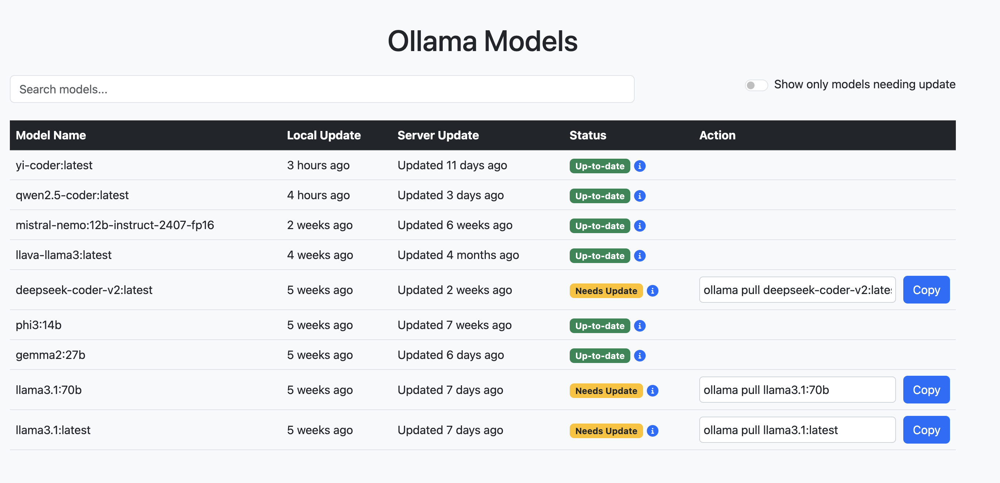

# Ollama Updater

A simple web application that checks for updates to locally installed Ollama models by comparing them with the latest versions available on the Ollama server.

## Features

- Lists all locally installed Ollama models.
- Compares local models with the latest versions available on the server.
- Indicates which models need updates.
- Provides commands to update outdated models.
- Allows rechecking models that had errors during data fetching.
- User-friendly interface with search and filter functionality.

## Prerequisites

- **Python 3.9+**
- **Flask**
- **Requests**
- **BeautifulSoup4**
- **Ollama** installed locally.

## Installation

1. **Clone the repository:**

   ```bash
   git clone https://github.com/r00tbear/ollama_updater.git
   cd ollama_updater
   ```

2. **Create and activate a virtual environment (optional but recommended):**

   ```bash
   python3 -m venv venv
   source venv/bin/activate  # On Windows, use venv\Scriptsctivate
   ```

3. **Install the required Python packages:**

   ```bash
   pip install -r requirements.txt
   ```

4. **Ensure Ollama is installed on your system:**

   Visit [Ollama.ai](https://ollama.com/) to download and install Ollama if you haven't already.

## Usage

1. **Run the Flask application:**

   ```bash
   python app.py
   ```

2. **Access the application in your web browser:**

   Open `http://localhost:5000` in your preferred web browser.

## Project Structure

- `app.py`: The main Flask application file.
- `templates/`: HTML templates for the frontend.
- `screenshots/`: Folder containing screenshots.

## Features Overview

- **Progress Steps:**

  Upon loading the page, the application will:

  1. Check if Ollama is installed.
  2. Retrieve the list of installed models.
  3. Fetch server model information.
  4. Display models and statuses.

- **Model List:**

  - Displays each model's name, local update time, server update time, status, and available actions.
  - Models that need updates are highlighted with a "Needs Update" badge.
  - Provides a copyable command to update each outdated model.
  - Models with errors during data fetching can be rechecked individually.

- **Search and Filter:**

  - Search bar to filter models by name or status.
  - Toggle to show only models that need updates.

## Screenshots

Here is an overview of the project structure:



## Contributing

Contributions are welcome! Please open an issue or submit a pull request with any improvements.

## Contact

For questions or support, please contact me via LinkedIn [https://www.linkedin.com/in/ayurev/](https://www.linkedin.com/in/ayurev/).
